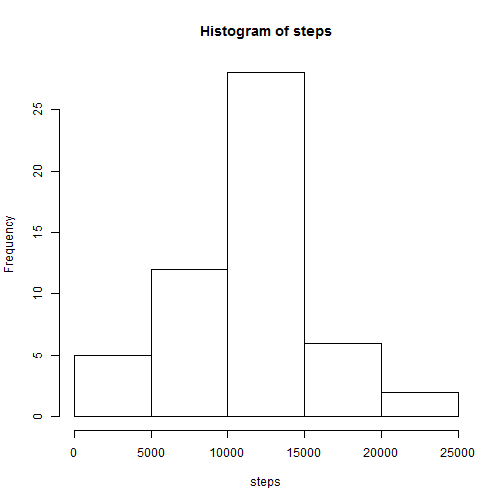
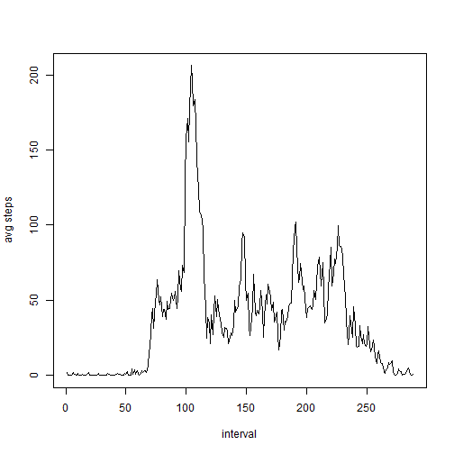
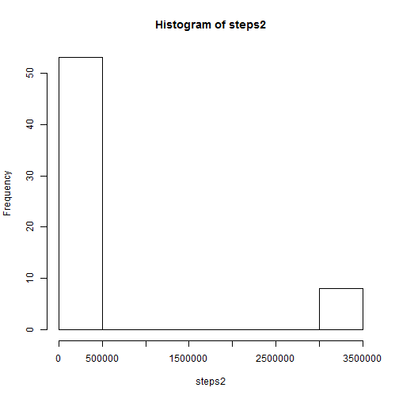
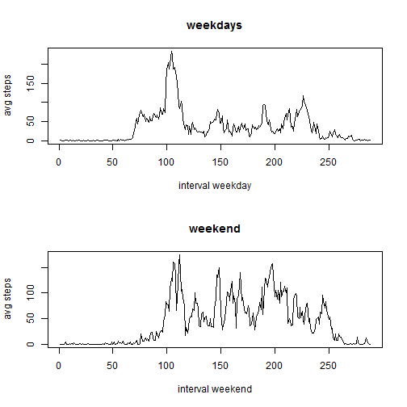

## Loading and preprocessing the data

### Package requiered: *base*

```r
DT<-read.csv("activity.csv", header=T)
```


## What is mean total number of steps taken per day?

### Histogram total number of steps:


```r
steps<-by(DT$steps, DT$date, function(x) sum(x))
hist(steps)
```

 

### Mean number of steps per day : 1.0766189 &times; 10<sup>4</sup>
### Median number of steps per day 10765

## What is the average daily activity pattern?


```r
dailyavg<-by(DT$steps, DT$interval, function(x) mean(x, na.rm="true"))
plot(dailyavg, type="l", xlab="interval", ylab="avg steps")
```

 


### Maximum interval: 520 th minute

## Imputing missing values

### NA values are imputed by the mean across all days


```r
nas<-is.na(DT$steps)
DTimp<-DT
DTimp[nas,"steps"]<-mean(steps, na.rm="true")
```
### Calculate histogram, mean and median with imputed dataset


```r
steps2<-by(DTimp$steps, DTimp$date, function(x) sum(x))
hist(steps2)
```

 

### Mean number of steps per day : 4.1599847 &times; 10<sup>5</sup> Difference: 4.0523228 &times; 10<sup>5</sup>
### Median number of steps per day: 1.1458 &times; 10<sup>4</sup> Difference: 691.8113208


## Are there differences in activity patterns between weekdays and weekends?


```r
DTweekdays<-weekdays(as.Date(DT$date))
DTweekdays[DTweekdays=="Montag"]<-1
DTweekdays[DTweekdays=="Dienstag"]<-1
DTweekdays[DTweekdays=="Mittwoch"]<-1
DTweekdays[DTweekdays=="Donnerstag"]<-1
DTweekdays[DTweekdays=="Freitag"]<-1
DTweekdays[DTweekdays=="Samstag"]<-0
DTweekdays[DTweekdays=="Sonntag"]<-0
DT1<-cbind(DT,DTweekdays)
weekday<-DT1[DT1$DTweekdays==1,]
weekdayavg<-by(weekday$steps, weekday$interval, function(x) mean(x, na.rm="true"))
weekend<-DT1[DT1$DTweekdays==0,]
weekendavg<-by(weekend$steps, weekend$interval, function(x) mean(x, na.rm="true"))
par(mfrow=c(2,1)) 
plot(weekdayavg, type="l", xlab="interval weekday", ylab="avg steps", main="weekdays")
plot(weekendavg, type="l", xlab="interval weekend", ylab="avg steps", main="weekend")
```

 

###Yes there are differences
